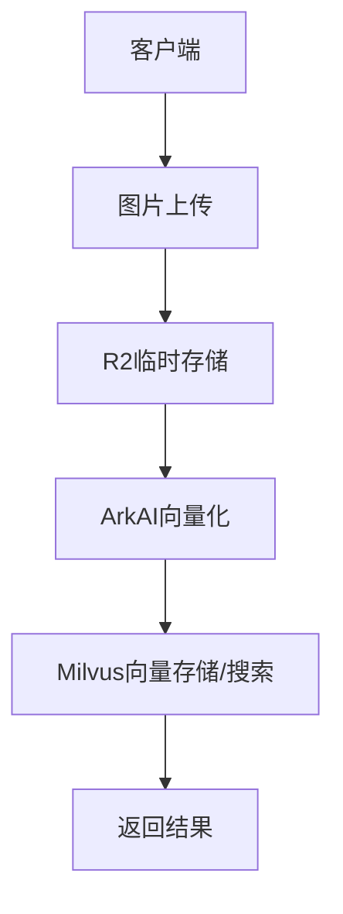

# Test/Milvus 接口文档 - 以图搜图功能

## 1. 功能概述

本文档详细描述了 Wishing PIM Servers TS 项目中的以图搜图功能相关接口。该功能基于 Milvus 向量数据库和火山引擎 ArkAI 实现，允许用户上传图片并查找相似的产品图片。

### 核心功能点

- **图片向量化**：将上传的图片通过 ArkAI 转换为高维向量
- **向量存储**：将图片向量存储到 Milvus 向量数据库
- **相似图片搜索**：基于向量相似度查询最相似的图片

## 2. 技术架构



## 3. 接口详情

### 3.1 图片向量化存储接口

该接口用于批量上传图片，进行向量化处理并存储到 Milvus 数据库。

**接口路径**：`/test/ark-ai-embedding`  
**请求方法**：`POST`  
**Content-Type**：`multipart/form-data`

#### 请求参数

| 参数名 | 参数类型 | 是否必需 | 描述 |
|--------|----------|----------|------|
| files | File[] | 是 | 要上传的图片文件数组 |

#### 处理流程

1. 接收上传的图片文件
2. 将图片存储到 R2 云存储的 `img/` 目录
3. 构建图片 URL（格式：`http://cf-cdn-temp.apex-fareast.com/img/文件名`）
4. 调用 ArkAI 的 embedding 接口获取图片向量
5. 将图片 URL 和向量数据组装为实体对象
6. 将实体对象批量插入 Milvus 的 `product_img` 集合

#### 代码实现

```typescript
.post(
  "/ark-ai-embedding",
  async ({ ArkAI, r2_temp, body: { files }, set, milvus }) => {
    const embeddings = await Promise.all(
      files.map(async (file) => {
        const fileStorePath = "img/" + file.name;
        const fileUrl =
          "http://cf-cdn-temp.apex-fareast.com/" + fileStorePath;
        await r2_temp.setItemRaw(fileStorePath, file);
        // Delay 1 second to ensure the image is stored in R2
        await new Promise((resolve) => setTimeout(resolve, 1000));
        const imgEmbedding = await ArkAI.embedding(undefined, [
          { type: "image_url", image_url: { url: fileUrl } },
        ]);
        return {
          imgEmbedding,
          fileUrl,
        };
      })
    );
    // Prepare data for Milvus insert
    const entities = files.map((file, idx) => ({
      filename: embeddings[idx].fileUrl,
      vector: embeddings[idx].imgEmbedding,
    }));

    // Insert into Milvus product_img collection
    const result = await milvus.insert({
      collection_name: "product_img",
      data: entities,
    });

    return {
      ids: (result.IDs as any)["int_id"].data,
    };
  },
  {
    body: t.Object({
      files: t.Files(),
    }),
  }
)
```

#### 响应示例

```json
{
  "ids": [448515945473728513, 448515945473728514]
}
```

### 3.2 以图搜图查询接口

该接口用于上传一张查询图片，查找 Milvus 数据库中最相似的图片。

**接口路径**：`/test/milvus-query`  
**请求方法**：`POST`  
**Content-Type**：`multipart/form-data`

#### 请求参数

| 参数名 | 参数类型 | 是否必需 | 描述 |
|--------|----------|----------|------|
| file | File | 是 | 查询用的图片文件 |

#### 处理流程

1. 接收上传的查询图片
2. 将图片临时存储到 R2 云存储的 `temp/` 目录
3. 构建图片 URL（格式：`http://cf-cdn-temp.apex-fareast.com/temp/文件名`）
4. 调用 ArkAI 的 embedding 接口获取查询图片的向量
5. 使用 Milvus 的 search 方法在 `product_img` 集合中查找最相似的 5 个结果
6. 返回搜索结果，包含相似图片的 ID、文件名和相似度分数

#### 代码实现

```typescript
.post(
  "/milvus-query",
  async ({ milvus, r2_temp, ArkAI, body: { file } }) => {
    // 将用户图片通过 arkAI 向量化, 并查询 milvus 中最相似的 5 个商品, 返回 milvus 的结果.
    const fileStorePath = "temp/" + file.name;
    const fileUrl = "http://cf-cdn-temp.apex-fareast.com/" + fileStorePath;
    await r2_temp.setItemRaw(fileStorePath, file);
    // Delay 1 second to ensure the image is stored in R2
    await new Promise((resolve) => setTimeout(resolve, 