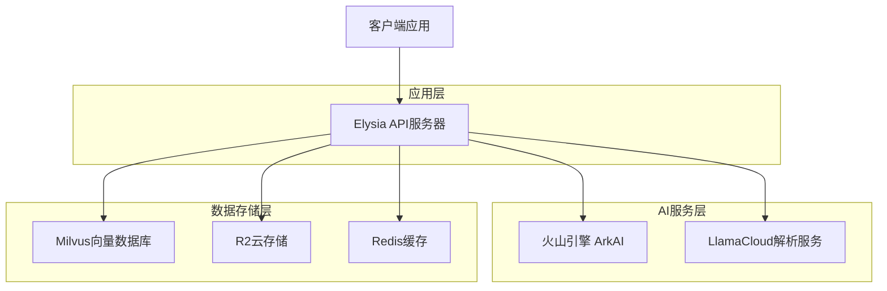
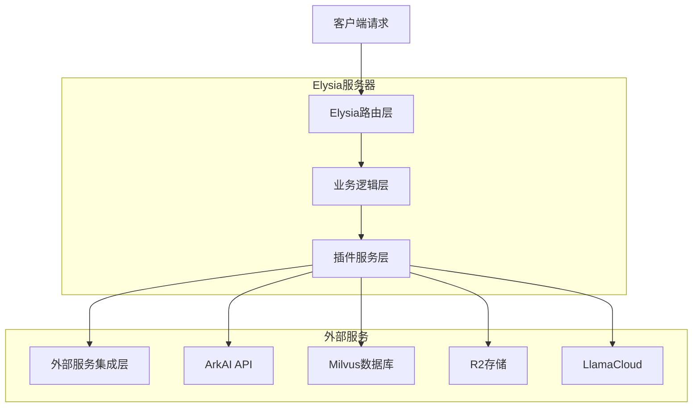
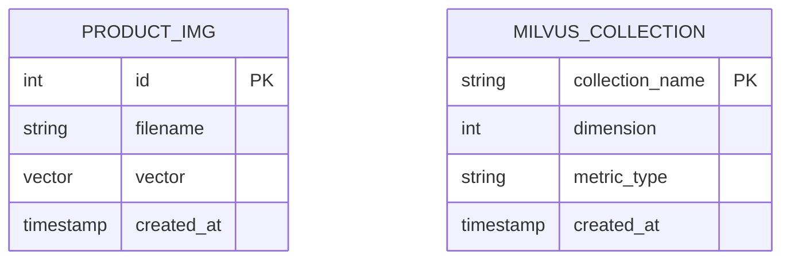

# Wishing PIM Servers TS 技术架构文档

## 1. 架构设计



## 2. 技术描述

- **后端框架**: Elysia (TypeScript) + Bun运行时
- **向量数据库**: Milvus 2.x (@zilliz/milvus2-sdk-node)
- **AI服务**: 火山引擎 ArkAI (图片向量化、对话)
- **云存储**: R2 (Cloudflare) + TOS (火山引擎)
- **文档解析**: LlamaCloud
- **缓存**: Redis
- **存储抽象**: Unstorage

## 3. 路由定义

| 路由 | 用途 |
|------|-----|
| /test/ark-ai-embedding | 图片上传和向量化存储接口 |
| /test/milvus-query | 以图搜图查询接口 |
| /test/pdf-parse | PDF文档解析接口 |
| /test/ark-ai-chat | AI对话接口 |
| /test/files-upload | 文件上传测试接口 |
| /test/unstorage | 存储管理测试接口 |
| /test/get-milvus-test-count | Milvus数据统计接口 |
| /poole-ftp/* | FTP文件管理相关接口 |

## 4. API定义

### 4.1 核心API

#### 图片向量化存储
```
POST /test/ark-ai-embedding
```

请求参数:
| 参数名 | 参数类型 | 是否必需 | 描述 |
|--------|----------|----------|------|
| files | File[] | true | 要上传的图片文件数组 |

响应:
| 参数名 | 参数类型 | 描述 |
|--------|----------|------|
| ids | number[] | 存储到Milvus的记录ID数组 |

示例响应:
```json
{
  "ids": [448515945473728513, 448515945473728514]
}
```

#### 以图搜图查询
```
POST /test/milvus-query
```

请求参数:
| 参数名 | 参数类型 | 是否必需 | 描述 |
|--------|----------|----------|------|
| file | File | true | 查询用的图片文件 |

响应:
| 参数名 | 参数类型 | 描述 |
|--------|----------|------|
| results | SearchResult[] | 相似图片搜索结果 |

#### AI对话接口
```
GET /test/ark-ai-chat?msg=消息内容
```

请求参数:
| 参数名 | 参数类型 | 是否必需 | 描述 |
|--------|----------|----------|------|
| msg | string | false | 对话消息内容 |

#### PDF解析接口
```
POST /test/pdf-parse
```

请求参数:
| 参数名 | 参数类型 | 是否必需 | 描述 |
|--------|----------|----------|------|
| files | File[] | true | 要解析的PDF文件数组 |

## 5. 服务器架构图



## 6. 数据模型

### 6.1 数据模型定义



### 6.2 数据定义语言

#### Milvus集合创建
```javascript
// 创建product_img集合
await milvus.createCollection({
  collection_name: "product_img",
  fields: [
    {
      name: "id",
      data_type: DataType.Int64,
      is_primary_key: true,
      auto_id: true
    },
    {
      name: "filename",
      data_type: DataType.VarChar,
      max_length: 512
    },
    {
      name: "vector",
      data_type: DataType.FloatVector,
      dim: 1024  // ArkAI向量维度
    }
  ]
});

// 创建索引
await milvus.createIndex({
  collection_name: "product_img",
  field_name: "vector",
  index_type: "IVF_FLAT",
  metric_type: "COSINE",
  params: { nlist: 128 }
});
```

#### 数据插入示例
```javascript
// 插入向量数据
const entities = files.map((file, idx) => ({
  filename: embeddings[idx].fileUrl,
  vector: embeddings[idx].imgEmbedding,
}));

await milvus.insert({
  collection_name: "product_img",
  data: entities,
});
```

#### 向量搜索示例
```javascript
// 搜索相似向量
const queryResult = await milvus.search({
  collection_name: "product_img",
  data: imgEmbedding,
  limit: 5,
  output_fields: ["id", "filename"],
});
```