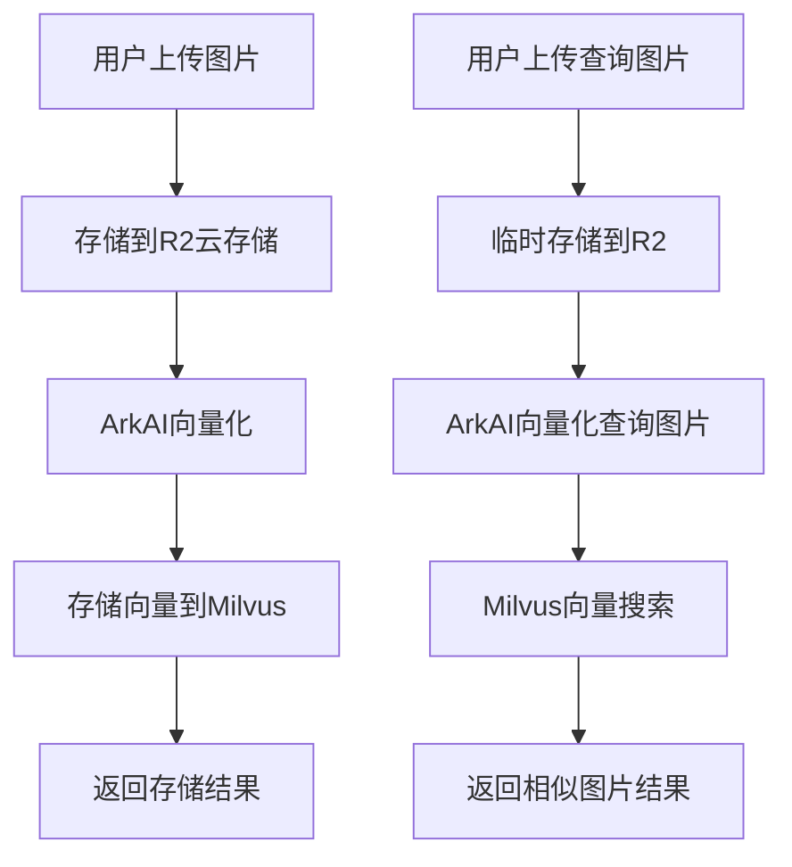

# Wishing PIM Servers TS 项目需求文档

## 1. 产品概述

Wishing PIM Servers TS 是一个基于 TypeScript 和 Elysia 框架构建的产品信息管理（PIM）服务器系统。该系统的核心功能是实现智能的以图搜图功能，帮助用户通过上传图片快速找到相似的产品图片。

- 主要解决问题：传统的产品图片管理和搜索效率低下，用户难以快速找到相似的产品图片
- 目标用户：电商平台、产品管理人员、设计师等需要进行图片管理和搜索的用户
- 产品价值：通过AI向量化技术实现高精度的图片相似度搜索，提升产品管理效率

## 2. 核心功能

### 2.1 用户角色

本系统主要面向开发者和API调用者，不区分特定的用户角色，通过API接口提供服务。

### 2.2 功能模块

我们的PIM系统包含以下主要页面和模块：

1. **API服务页面**：提供RESTful API接口，支持图片上传、向量化、搜索等核心功能
2. **图片管理模块**：图片上传、存储、向量化处理
3. **搜索服务模块**：基于向量相似度的图片搜索功能
4. **测试接口模块**：提供各种测试和调试接口

### 2.3 页面详情

| 页面名称 | 模块名称 | 功能描述 |
|---------|---------|---------|
| API服务页面 | 图片上传接口 | 支持多文件上传，自动进行向量化处理并存储到Milvus数据库 |
| API服务页面 | 以图搜图接口 | 接收用户上传的查询图片，返回最相似的5个产品图片 |
| API服务页面 | 文档解析接口 | 支持PDF等文档的解析和处理 |
| API服务页面 | AI对话接口 | 集成火山引擎ArkAI，提供智能对话功能 |
| API服务页面 | 存储管理接口 | 管理云存储中的文件和数据 |

## 3. 核心流程

### 图片向量化存储流程
1. 用户通过API上传图片文件
2. 系统将图片存储到R2云存储
3. 调用火山引擎ArkAI进行图片向量化
4. 将向量数据存储到Milvus向量数据库
5. 返回存储成功的ID列表

### 以图搜图查询流程
1. 用户上传查询图片
2. 系统将图片临时存储到R2
3. 调用ArkAI对查询图片进行向量化
4. 在Milvus中搜索最相似的向量
5. 返回相似度最高的5个结果

## 4. 用户界面设计

### 4.1 设计风格

本系统主要提供API服务，不包含前端界面，但API响应遵循以下设计原则：
- 响应格式：统一的JSON格式
- 错误处理：标准的HTTP状态码和错误信息
- 数据结构：清晰的数据字段命名和类型定义
- 接口风格：RESTful API设计规范

### 4.2 API接口设计概览

| 接口名称 | 请求方法 | 功能描述 |
|---------|---------|---------|
| /test/ark-ai-embedding | POST | 图片上传和向量化存储 |
| /test/milvus-query | POST | 以图搜图查询接口 |
| /test/pdf-parse | POST | PDF文档解析 |
| /test/ark-ai-chat | GET | AI对话接口 |
| /test/unstorage | GET | 存储管理接口 |

### 4.3 响应性

系统设计为云原生架构，支持水平扩展，能够处理高并发的API请求。通过异步处理和缓存机制确保响应性能。